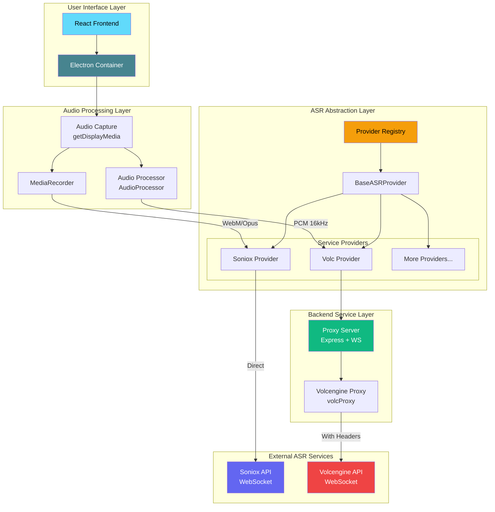

# DeLive 🎙️

**[中文](./README.md) | English**

**Windows Desktop Audio Real-time Transcription** - Multi-ASR Provider Support

Capture any audio playing on your computer (browser videos, online meetings, podcasts, etc.) and transcribe it to text in real-time.


## ✨ Features

- 🎯 **Real-time Transcription** - Capture system audio and convert to text instantly
- 🔌 **Multi-Provider Support** - Supports Soniox, Volcengine, and more ASR providers
- 🌍 **Multi-language Support** - Supports Chinese, English, and 60+ languages
- 📚 **History Records** - Grouped by date/time, with custom titles and tags
- 📤 **Export Function** - One-click export to TXT files
- 🎨 **Dark/Light Theme** - Theme switching to protect your eyes
- 🖥️ **Modern UI** - Frameless window with custom title bar
- 🚀 **Auto Start** - Optional auto-start at login, minimize to tray
- 💾 **Data Backup** - Import/export data for easy migration
- 🌐 **Interface Language** - Supports Chinese and English interface

## 🏗️ System Architecture



### Architecture Overview

| Layer | Component | Description |
|-------|-----------|-------------|
| **User Interface** | React + Electron | Modern desktop application interface |
| **Audio Processing** | AudioProcessor / MediaRecorder | Process audio format based on ASR service requirements |
| **ASR Abstraction** | Provider Registry | Unified ASR service interface, supports dynamic provider switching |
| **Backend Service** | Express + WebSocket | Proxy for services requiring custom Headers |
| **External Services** | Soniox / Volcengine | Actual speech recognition cloud services |

## 🔌 Supported ASR Services

| Provider | Status | Features |
|----------|--------|----------|
| **Soniox** | ✅ Supported | High accuracy, multi-language, direct WebSocket |
| **Volcengine** | ✅ Supported | Chinese optimized, proxy connection |
| *More providers* | 🔜 Planned | Extensible architecture, easy to add new providers |

## 🚀 Quick Start

### Prerequisites

- Node.js 18+
- ASR Service API Key (choose one):
  - [Soniox API Key](https://console.soniox.com)
  - [Volcengine APP ID and Access Token](https://console.volcengine.com/speech/app)

### Installation

```bash
# Clone the project
git clone https://github.com/XimilalaXiang/DeLive.git
cd DeLive

# Install all dependencies
npm run install:all
```

### Development Mode

```bash
# Start backend server (required for Volcengine)
cd server && npm run dev

# In another terminal, start frontend + Electron
npm run dev
```

### Build

```bash
# Build Windows application
npm run dist:win
```

Built files are located in the `release/` directory:
- `DeLive-x.x.x-x64.exe` - Installer
- `DeLive-x.x.x-portable.exe` - Portable version

## 📖 Usage

1. **Select Provider** - Click settings and choose your ASR service provider
2. **Configure API Key** - Enter the corresponding API key for your provider
3. **Test Configuration** - Click "Test Config" to verify settings
4. **Start Recording** - Click the "Start Recording" button
5. **Select Audio Source** - Choose the screen/window to share (check "Share audio")
6. **Real-time Transcription** - The system will automatically capture audio and display results
7. **Stop Recording** - Click "Stop Recording", transcription will be saved to history

## 📁 Project Structure

```
DeLive/
├── electron/              # Electron main process
│   ├── main.ts               # Main process entry
│   └── preload.ts            # Preload script
├── frontend/              # React frontend
│   ├── src/
│   │   ├── components/       # UI components
│   │   ├── hooks/            # Custom Hooks
│   │   ├── providers/        # ASR provider implementations
│   │   │   ├── base.ts           # Base class
│   │   │   ├── registry.ts       # Provider registry
│   │   │   └── implementations/  # Provider implementations
│   │   ├── stores/           # Zustand state management
│   │   ├── types/            # TypeScript types
│   │   │   └── asr/              # ASR related type definitions
│   │   ├── utils/            # Utility functions
│   │   │   └── audioProcessor.ts # Audio processor
│   │   └── i18n/             # Internationalization
│   └── ...
├── server/                # Backend proxy service
│   └── src/
│       ├── index.ts          # Express server
│       └── volcProxy.ts      # Volcengine WebSocket proxy
├── build/                 # App icon resources
├── scripts/               # Build scripts
└── package.json
```

## 🔧 Tech Stack

| Layer | Technology |
|-------|------------|
| Desktop Framework | Electron 40 |
| Frontend | React 18 + TypeScript + Vite |
| Styling | Tailwind CSS |
| State Management | Zustand |
| Backend | Express + ws |
| ASR Engine | Soniox V3 / Volcengine |
| Bundler | electron-builder |

## ⌨️ Keyboard Shortcuts

| Shortcut | Function |
|----------|----------|
| `Ctrl+Shift+D` | Show/Hide main window |

## 🔧 Adding New ASR Providers

DeLive uses an extensible provider architecture. To add a new provider:

1. Create a new Provider class in `frontend/src/providers/implementations/`
2. Extend `BaseASRProvider` and implement required methods
3. Register the new provider in `registry.ts`
4. If the service requires custom Headers, add a proxy in `server/src/`

Refer to existing implementations (`SonioxProvider.ts` and `VolcProvider.ts`) for detailed guidance.

## ⚠️ Notes

1. **System Requirements** - Windows 10/11 64-bit
2. **API Quota** - Be aware of each provider's API usage limits
3. **Volcengine** - Requires starting the backend server (`cd server && npm run dev`)
4. **Tray Behavior** - Clicking close minimizes to tray, right-click tray icon and select "Exit" to fully close

## 📄 License

MIT License

## 🙏 Acknowledgments

- [Soniox](https://soniox.com) - Powerful speech recognition API
- [Volcengine](https://www.volcengine.com) - Chinese-optimized speech recognition service
- [BiBi-Keyboard](https://github.com/BryceWG/BiBi-Keyboard) - Multi-provider architecture reference
- [Electron](https://www.electronjs.org/) - Cross-platform desktop application framework
- [React](https://react.dev/) - User interface library
- [Tailwind CSS](https://tailwindcss.com/) - CSS framework

---

<div align="center">

[](https://www.star-history.com/#XimilalaXiang/DeLive&type=date&legend=top-left)

Made with ❤️ by [XimilalaXiang](https://github.com/XimilalaXiang)

</div>
