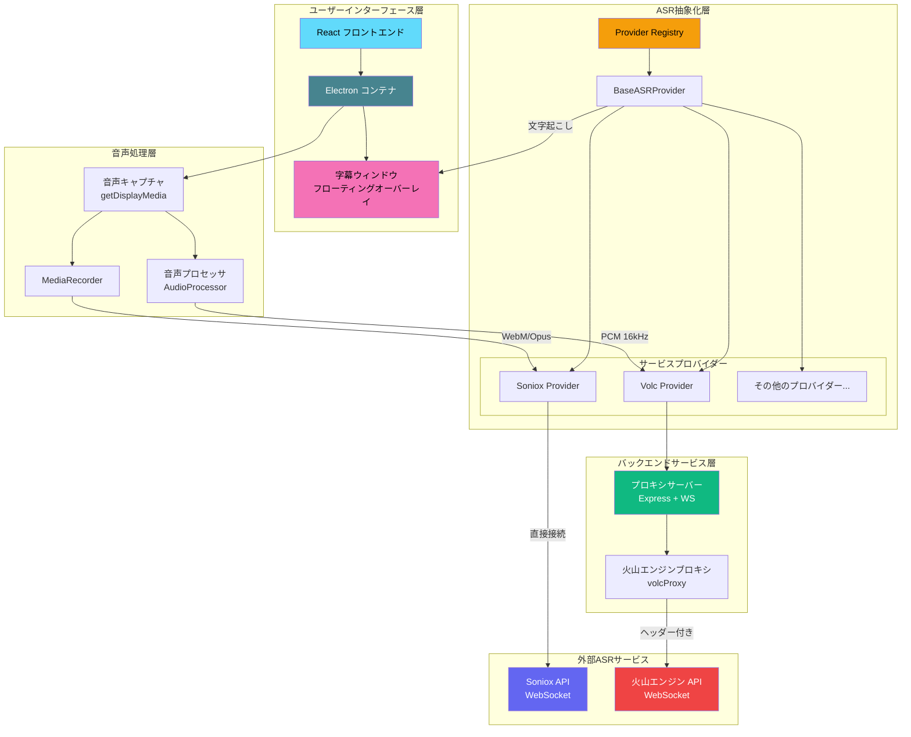

<div align="center">


# DeLive

|**システムレベル音声キャプチャ | 字幕なしコンテンツの最終保障**|

|[English](./README.md) | [简体中文](./README_ZH.md) | [繁體中文](./README_TW.md) | 日本語|

[](https://github.com/XimilalaXiang/DeLive/releases)
[](https://github.com/XimilalaXiang/DeLive/blob/main/LICENSE)
[](https://github.com/XimilalaXiang/DeLive/releases)
[](https://github.com/XimilalaXiang/DeLive/releases)
[](https://github.com/XimilalaXiang/DeLive)

[DeLiveを選ぶ理由](#-deliveを使うタイミング) • [クイックスタート](#-クイックスタート) • [システムアーキテクチャ](#️-システムアーキテクチャ)

</div>

システムの音声出力を直接キャプチャします。プラットフォームがコンテンツをどう保護しようとも、DRMが動画を暗号化していようとも、ライブ配信がリアルタイムで配信されていようとも——パソコンから音が発信されれば、DeLiveはそれを文字に起こします。

<div align="center>

</div>

## 💡 DeLiveを使うタイミング

**他のすべての手段がblockedされたときの最終手段です。**

字幕エクスポートプラグインが機能しない、プラットフォームがダウンロードを禁止している、ライブ配信に字幕がない、コンテンツがDRMで保護されている場合——システムレベル音声キャプチャがあなたの最終的な保障となります。

字幕や文字起こししたコンテンツをナレッジベース構築、分析、調査などの目的でエクスポートする必要がありますが、プラットフォームが制限を設けていますか？DeLiveはシステム音声をキャプチャし、きれいでエクスポート可能なテキストを納品します。

### 🎯 コア機能

- **🎧 システムレベル音声キャプチャ** - システム音声出力を直接キャプチャし、プラットフォーム制限をバイパス
- **🛡️ 保護制限を突破** - ダウンロード禁止、DRM保護、字幕エクスポート不可のプラットフォームに対応
- **📺 あらゆるシーンに対応** - ライブ配信、録画動画会議、プライベートコース、有料コンテンツ...音声があるあらゆるシナリオ
- **⚡ リアルタイム文字起こし** - 再生しながら低遅延で文字起こし
- **📢 リアルタイム字幕** - フローティング字幕ウィンドウ、フォント、色、サイズ、位置をカスタマイズ可能
- **📤 TXT/SRTにエクスポート** - シンプルなテキストファイルまたはタイムスタンプ付き字幕ファイル
- **🌐 60以上の言語対応** - 中国語、英語、日本語など60以上の言語
- **🔄 複数のASRプロバイダー** - 異なる精度や価格で柔軟に切り替え可能

### 🎨 ユーザーエクスペリエンス

- **ダーク/ライトテーマ** - どのような環境でも快適に視聴可能
- **モダンなインターフェース** - シンプルでフレームレスなデザイン、カスタムタイトルバー
- **ログイン時の自動起動** - パソコン起動後すぐに使用可能
- **システムトレイ統合** - バックグラウンドで静かに実行
- **バイリンガルインターフェース** - 中文と英語のインターフェースを自由に切り替え
- **自動更新** - 最新バージョンを自動検出・ダウンロード

## 🏗️ システムアーキテクチャ



### アーキテクチャ概要

|| レイヤー | コンポーネント | 説明 |
||----------|--------------|------|
|| **ユーザーインターフェース** | React + Electron | モダンなデスクトップアプリケーションインターフェース |
|| **字幕ウィンドウ** | 透明 BrowserWindow | カスタマイズ可能なスタイルのフローティング字幕オーバーレイ |
|| **音声処理** | AudioProcessor / MediaRecorder | ASRサービスの要件に基づいて音声フォーマットを処理 |
|| **ASR抽象化** | Provider Registry | 統一されたASRサービスインターフェース、動的なプロバイダー切り替えをサポート |
|| **バックエンドサービス** | Express + WebSocket | カスタムヘッダーが必要なサービス用のプロキシ |
|| **外部サービス** | Soniox / 火山エンジン | 実際の音声認識クラウドサービス |

## 🔌 対応ASRサービス

|| プロバイダー | ステータス | 特徴 |
||-------------|----------|------|
|| **Soniox** | ✅ 対応 | 高精度、多言語、直接WebSocket接続 |
|| **火山エンジン** | ✅ 対応 | 中国語最適化、プロキシ経由接続 |
|| *その他のプロバイダー* | 🔜 計画中 | 拡張可能なアーキテクチャ、新しいプロバイダーの追加が容易 |

## 🚀 クイックスタート

### 前提条件

- Node.js 18+
- ASRサービスAPIキー（いずれかを選択）:
  - [Soniox APIキー](https://console.soniox.com)
  - [火山エンジン APP IDとAccess Token](https://console.volcengine.com/speech/app)

### インストール

```bash
|# プロジェクトをクローン
git clone https://github.com/XimilalaXiang/DeLive.git
cd DeLive

|# すべての依存関係をインストール
npm run install:all
```

### 開発モード

```bash
|# バックエンドサーバーを起動（火山エンジン使用時に必要）
cd server && npm run dev

|# 別のターミナルでフロントエンド + Electronを起動
npm run dev
```

### ビルド

```bash
|# Windowsアプリケーションをビルド
npm run dist:win
```

ビルドされたファイルは `release/` ディレクトリにあります：
- `DeLive-x.x.x-x64.exe` - インストーラー
- `DeLive-x.x.x-portable.exe` - ポータブル版

## 📖 使い方

### 基本的な文字起こし
1. **プロバイダーを選択** - 設定をクリックしてASRサービスプロバイダーを選択
2. **APIキーを設定** - 対応するプロバイダーのAPIキーを入力
3. **設定をテスト** - 「設定をテスト」をクリックして設定を確認
4. **録音を開始** - 「録音開始」ボタンをクリック
5. **音声ソースを選択** - 共有する画面/ウィンドウを選択（「音声を共有」にチェック）
6. **リアルタイム文字起こし** - システムが自動的に音声をキャプチャして結果を表示
7. **録音を停止** - 「録音停止」をクリック、文字起こしは履歴に自動保存

### リアルタイム画面字幕（新機能）
1. **字幕を有効化** - 設定で「字幕を表示」ボタンをクリック
2. **スタイルをカスタマイズ** - 設定アイコンをクリックしてフォント、色、背景などを調整
3. **字幕を移動** - 字幕ウィンドウにホバーし、ロックアイコンをクリックしてロック解除、ドラッグして位置を調整
4. **位置をロック** - ロックアイコンを再度クリックして字幕を固定
5. **位置をリセット** - 「位置をリセット」ボタンをクリックしてデフォルト位置に戻す

### エクスポートオプション
- **TXTにエクスポート** - エクスポートボタンをクリックしてTXTフォーマットを選択
- **SRTにエクスポート** - エクスポートボタンをクリックしてSRTフォーマットを選択して字幕ファイルとしてエクスポート

## 📁 プロジェクト構造

```
DeLive/
├── electron/              # Electronメインプロセス
│   ├── main.ts               # メインプロセスエントリ
│   └── preload.ts            # プリロードスクリプト
├── frontend/              # Reactフロントエンド
│   ├── src/
│   │   ├── components/       # UIコンポーネント
│   │   │   ├── CaptionOverlay.tsx  # 字幕ウィンドウコンポーネント
│   │   │   ├── CaptionControls.tsx # 字幕設定コントロール
│   │   │   └── ...
│   │   ├── hooks/            # カスタムフック
│   │   ├── providers/        # ASRプロバイダー実装
│   │   │   ├── base.ts           # 基底クラス
│   │   │   ├── registry.ts       # プロバイダーレジストリ
│   │   │   └── implementations/  # プロバイダー実装
│   │   ├── stores/           # Zustand状態管理
│   │   ├── types/            # TypeScript型定義
│   │   │   └── asr/              # ASR関連の型定義
│   │   ├── utils/            # ユーティリティ関数
│   │   │   └── audioProcessor.ts # 音声プロセッサ
│   │   └── i18n/             # 国際化
│   └── ...
├── server/                # バックエンドプロキシサービス
│   └── src/
│       ├── index.ts          # Expressサーバー
│       └── volcProxy.ts      # 火山エンジンWebSocketプロキシ
├── build/                 # アプリアイコンリソース
├── scripts/               # ビルドスクリプト
└── package.json
```

## 🔧 技術スタック

|| レイヤー | 技術 |
||----------|------|
|| デスクトップフレームワーク | Electron 40 |
|| フロントエンド | React 18 + TypeScript + Vite |
|| スタイリング | Tailwind CSS |
|| 状態管理 | Zustand |
|| バックエンド | Express + ws |
|| ASRエンジン | Soniox V3 / 火山エンジン |
|| バンドラー | electron-builder |

## ⌨️ キーボードショートカット

|| ショートカット | 機能 |
||--------------|------|
|| `Ctrl+Shift+D` | メインウィンドウの表示/非表示 |

## 🔧 新しいASRプロバイダーの追加

DeLiveは拡張可能なプロバイダーアーキテクチャを使用しています。新しいプロバイダーを追加するには：

1. `frontend/src/providers/implementations/` に新しいProviderクラスを作成
2. `BaseASRProvider` を継承し、必要なメソッドを実装
3. `registry.ts` に新しいプロバイダーを登録
4. サービスがカスタムヘッダーを必要とする場合、`server/src/` にプロキシを追加

詳細なガイダンスについては、既存の実装（`SonioxProvider.ts` と `VolcProvider.ts`）を参照してください。

## ⚠️ 注意事項

1. **システム要件** - Windows 10/11 64ビット
2. **APIクォータ** - 各プロバイダーのAPI使用制限に注意
3. **火山エンジン** - バックエンドサーバーの起動が必要（`cd server && npm run dev`）
4. **トレイ動作** - 閉じるボタンをクリックするとトレイに最小化、トレイアイコンを右クリックして「終了」を選択で完全に閉じる
5. **字幕ウィンドウ** - 字幕ウィンドウは常に最前面に表示され、ロック時はマウスが透過

## 📄 ライセンス

Apache License 2.0

```
Apache 2.0 ライセンス - 著作権表示を保持すれば自由に使用、変更、配布可能
```

## 🙏 謝辞

- [Soniox](https://soniox.com) - 強力な音声認識API
- [火山エンジン](https://www.volcengine.com) - 中国語最適化音声認識サービス
- [BiBi-Keyboard](https://github.com/BryceWG/BiBi-Keyboard) - マルチプロバイダーアーキテクチャの参考
- [Electron](https://www.electronjs.org/) - クロスプラットフォームデスクトップアプリケーションフレームワーク
- [React](https://react.dev/) - ユーザーインターフェースライブラリ
- [Tailwind CSS](https://tailwindcss.com/) - CSSフレームワーク

---

<div align="center>

[](https://api.star-history.com/svg?repos=XimilalaXiang/DeLive&type=date&legend=top-left)

**Made with ❤️ by [XimilalaXiang](https://github.com/XimilalaXiang)**

</div>
