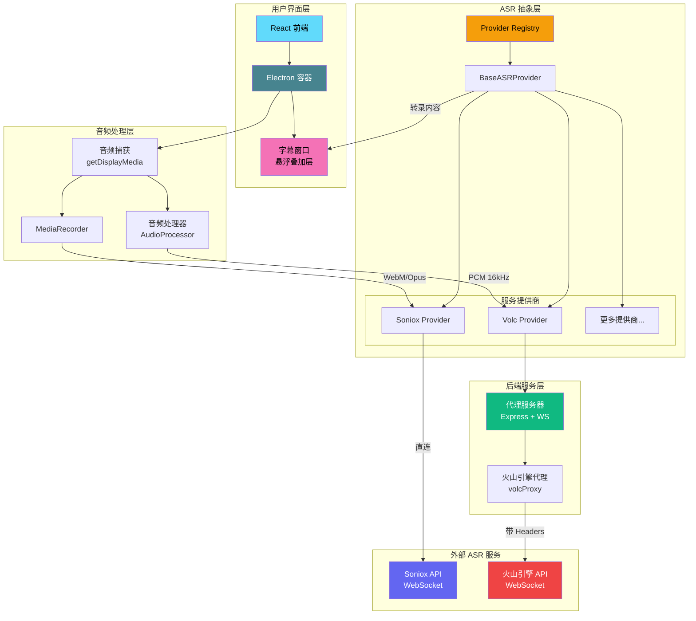

<div align="center">


# DeLive

**Windows 桌面音频实时转录系统 | 支持多 ASR 服务提供商**

[English](./README.md) | 简体中文 | [繁體中文](./README_TW.md) | [日本語](./README_JA.md)

[](https://github.com/XimilalaXiang/DeLive/releases)
[](https://github.com/XimilalaXiang/DeLive/blob/main/LICENSE)
[](https://github.com/XimilalaXiang/DeLive/releases)
[](https://github.com/XimilalaXiang/DeLive/releases)
[](https://github.com/XimilalaXiang/DeLive)

[为何选择 DeLive](#何时使用-delive) • [快速开始](#快速开始) • [系统架构](#系统架构)

</div>

直接捕获系统音频输出。无论平台如何保护内容、DRM 如何加密视频、直播如何实时播放——只要你的电脑能发出声音，DeLive 就能将其转录为文字。

<div align="center">

</div>

## 💡 何时使用 DeLive {#何时使用-delive}

**当所有其他路都被堵死时的最终选择。**

当字幕导出插件失效、平台禁止下载、直播没有字幕、内容受到 DRM 保护时——系统级音频捕获是你的终极保障。

需要导出字幕或转录内容用于构建知识库、分析、调研等用途，但平台受限？DeLive 捕获系统音频，交付干净、可导出的文本，你拥有完全的所有权。

### 🎯 核心功能

- **🎧 系统级音频捕获** - 直接捕获系统音频输出，绕过平台限制
- **🛡️ 突破防护限制** - 适用于禁止下载、有 DRM 保护、无法导出字幕的平台
- **📺 全场景覆盖** - 直播、录播、会议、私密课程、付费内容...任何有声音的场景
- **⚡ 实时转录** - 边播放边转文字，低延迟响应
- **📢 实时字幕** - 悬浮字幕窗口，支持自定义字体、颜色、大小和位置
- **📤 导出 TXT/SRT** - 简单文本文件或带时间戳的字幕文件
- **🌐 60+ 语言支持** - 中文、英文、日语等 60 多种语言
- **🔄 多 ASR 提供商** - 灵活切换，满足不同精度和价格需求

### 🎨 用户体验

- **深色/浅色主题** - 任意环境都能舒适观看
- **现代化界面** - 简洁无边框设计，自定义标题栏
- **开机自启动** - 电脑启动后即可使用
- **系统托盘集成** - 后台静默运行
- **双语界面** - 中文和英文界面任意切换
- **自动更新** - 自动检测和下载最新版本

## 🏗️ 系统架构 {#系统架构}



### 架构说明

| 层级 | 组件 | 说明 |
|------|------|------|
| **用户界面层** | React + Electron | 提供现代化的桌面应用界面 |
| **字幕窗口** | 透明 BrowserWindow | 可自定义样式的悬浮字幕叠加层 |
| **音频处理层** | AudioProcessor / MediaRecorder | 根据 ASR 服务要求处理音频格式 |
| **ASR 抽象层** | Provider Registry | 统一的 ASR 服务接口，支持动态切换提供商 |
| **后端服务层** | Express + WebSocket | 为需要自定义 Headers 的服务提供代理 |
| **外部服务** | Soniox / 火山引擎 | 实际的语音识别云服务 |

## 🔌 支持的 ASR 服务

| 服务商 | 状态 | 特点 |
|--------|------|------|
| **Soniox** | ✅ 支持 | 高精度、多语言、直连 WebSocket |
| **火山引擎** | ✅ 支持 | 中文优化、通过代理连接 |
| *更多服务商* | 🔜 计划中 | 可扩展架构，易于添加新提供商 |

## 🚀 快速开始 {#快速开始}

### 前置要求

- Node.js 18+
- ASR 服务 API 密钥（任选一个）:
  - [Soniox API 密钥](https://console.soniox.com)
  - [火山引擎 APP ID 和 Access Token](https://console.volcengine.com/speech/app)

### 安装

```bash
# 克隆项目
git clone https://github.com/XimilalaXiang/DeLive.git
cd DeLive

# 安装所有依赖
npm run install:all
```

### 开发模式

```bash
# 启动后端服务器（火山引擎需要）
cd server && npm run dev

# 在另一个终端启动前端 + Electron
npm run dev
```

### 打包构建

```bash
# 打包 Windows 应用
npm run dist:win
```

打包后的文件位于 `release/` 目录：
- `DeLive-x.x.x-x64.exe` - 安装程序
- `DeLive-x.x.x-portable.exe` - 便携版

## 📖 使用步骤

### 基本转录
1. **选择服务商** - 点击设置，选择你的 ASR 服务提供商
2. **配置 API 密钥** - 输入对应服务商的 API 密钥
3. **测试配置** - 点击"测试配置"验证设置是否正确
4. **开始录制** - 点击"开始录制"按钮
5. **选择音频源** - 在弹出的窗口中选择要共享的屏幕/窗口（需勾选"共享音频"）
6. **实时转录** - 系统将自动捕获音频并显示转录结果
7. **停止录制** - 点击"停止录制"按钮，转录内容将自动保存到历史记录

### 实时屏幕字幕（新功能）
1. **启用字幕** - 点击设置中的"显示字幕"按钮
2. **自定义样式** - 点击设置图标，调整字体、颜色、背景等
3. **移动字幕** - 鼠标悬停在字幕上，点击锁定图标解锁，然后拖拽调整位置
4. **锁定位置** - 再次点击锁定图标，固定字幕位置
5. **重置位置** - 点击"重置位置"按钮，恢复默认位置

### 导出选项
- **导出为 TXT** - 点击导出按钮，选择 TXT 格式
- **导出为 SRT** - 点击导出按钮，选择 SRT 格式导出字幕文件

## 📁 项目结构

```
DeLive/
├── electron/              # Electron 主进程
│   ├── main.ts               # 主进程入口
│   └── preload.ts            # 预加载脚本
├── frontend/              # React 前端
│   ├── src/
│   │   ├── components/       # UI 组件
│   │   │   ├── CaptionOverlay.tsx  # 字幕窗口组件
│   │   │   ├── CaptionControls.tsx # 字幕设置控件
│   │   │   └── ...
│   │   ├── hooks/            # 自定义 Hooks
│   │   ├── providers/        # ASR 服务提供商实现
│   │   │   ├── base.ts           # 基类
│   │   │   ├── registry.ts       # 提供商注册表
│   │   │   └── implementations/  # 各服务商实现
│   │   ├── stores/           # Zustand 状态管理
│   │   ├── types/            # TypeScript 类型
│   │   │   └── asr/              # ASR 相关类型定义
│   │   ├── utils/            # 工具函数
│   │   │   └── audioProcessor.ts # 音频处理器
│   │   └── i18n/             # 国际化
│   └── ...
├── server/                # 后端代理服务
│   └── src/
│       ├── index.ts          # Express 服务器
│       └── volcProxy.ts      # 火山引擎 WebSocket 代理
├── build/                 # 应用图标资源
├── scripts/               # 构建脚本
└── package.json
```

## 🔧 技术栈

| 层级 | 技术 |
|------|------|
| 桌面框架 | Electron 40 |
| 前端 | React 18 + TypeScript + Vite |
| 样式 | Tailwind CSS |
| 状态管理 | Zustand |
| 后端 | Express + ws |
| ASR 引擎 | Soniox V3 / 火山引擎 |
| 打包工具 | electron-builder |

## ⌨️ 快捷键

| 快捷键 | 功能 |
|--------|------|
| `Ctrl+Shift+D` | 显示/隐藏主窗口 |

## 🔧 添加新的 ASR 服务商

DeLive 采用可扩展的提供商架构，添加新服务商只需：

1. 在 `frontend/src/providers/implementations/` 创建新的 Provider 类
2. 继承 `BaseASRProvider` 并实现必要方法
3. 在 `registry.ts` 中注册新提供商
4. 如果服务需要自定义 Headers，在 `server/src/` 添加相应代理

详细指南请参考现有实现（如 `SonioxProvider.ts` 和 `VolcProvider.ts`）。

## ⚠️ 注意事项

1. **系统要求** - Windows 10/11 64位
2. **API 配额** - 注意各服务商的 API 使用配额限制
3. **火山引擎** - 需要启动后端服务器（`cd server && npm run dev`）
4. **托盘行为** - 点击关闭按钮会最小化到托盘，右键托盘图标选择"退出"完全关闭
5. **字幕窗口** - 字幕窗口始终置顶，锁定时鼠标可穿透

## 📄 许可证

Apache License 2.0

```
Apache 2.0 许可证 - 可自由使用、修改和分发，需保留版权声明
```

## 🙏 致谢

- [Soniox](https://soniox.com) - 提供强大的语音识别 API
- [火山引擎](https://www.volcengine.com) - 提供中文优化的语音识别服务
- [BiBi-Keyboard](https://github.com/BryceWG/BiBi-Keyboard) - 多服务商架构参考
- [Electron](https://www.electronjs.org/) - 跨平台桌面应用框架
- [React](https://react.dev/) - 用户界面库
- [Tailwind CSS](https://tailwindcss.com/) - CSS 框架

---

<div align="center">

[](https://www.star-history.com/#XimilalaXiang/DeLive&type=date&legend=top-left)

**Made with ❤️ by [XimilalaXiang](https://github.com/XimilalaXiang)**

</div>
